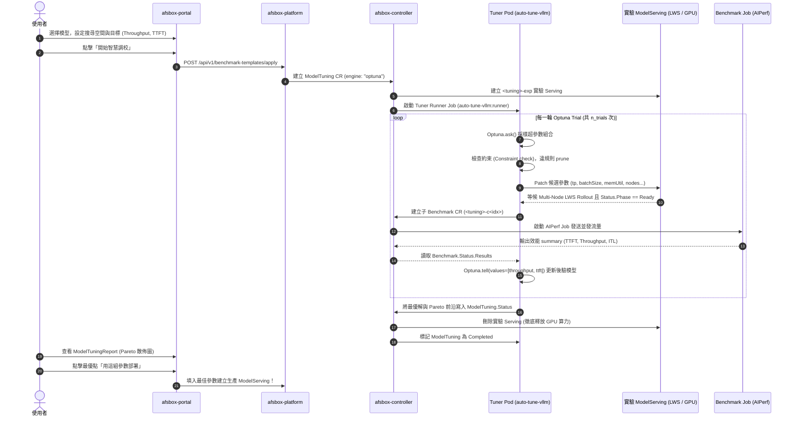

# AFSBox × auto-tuning-vllm (Optuna) 超參數自動調校整合設計與規劃

## 一、架構背景與設計理念

### 1.1 背景與問題
AFSBox 現有的推論調校功能（`ModelTuning`）採用靜態網格搜尋（Grid Search / Zip / OneAtATime）：
- **維度爆炸**：若調校 4 個維度各 4 個數值，需執行 $4^4 = 256$ 次測試。每次測試含 Pod 啟動、權重加載、預熱與 AIPerf 壓測約需 5~10 分鐘，整體耗時過長。
- **缺乏反饋（Blind Search）**：無法依據前期測試結果進行自適應學習；若某參數區間引發 OOM，靜態搜尋仍會重複嘗試。
- **難以權衡多目標**：Throughput（每秒吞吐）與 TTFT（首字延遲）通常互斥，使用者缺乏直觀的 Pareto 前沿決策依據。

### 1.2 整合目標
引進 [`auto-tuning-vllm`](https://github.com/openshift-psap/auto-tuning-vllm) 的 Optuna 核心，實現：
1. **自適應學習**：使用 TPE（貝氏最佳化）與 NSGA-II（多目標基因演算法），以 20~40 次 Trial 快速收斂至最佳參數區域。
2. **多目標 Pareto 前沿**：同時最佳化 Throughput（最大化）與 TTFT P95（最小化），產出帕雷托前沿解集。
3. **無效參數剪枝（Pruning）**：提前攔截不合規或已失敗的參數組合，零浪費 GPU 算力。
4. **保留 AFSBox 雲原生與多節點優勢**：完整複用 AFSBox 的 LeaderWorkerSet (LWS)、RDMA 互聯、S3 直讀串流與 NVIDIA AIPerf 壓測體系。

---

## 二、角色職責分工（Architecture & Roles）

採用**「方案 C：AFSBox 原生驅動 + auto-tune-vllm 演算法大腦」**模式：

```
┌─────────────────────────────────────────────────────────────────────────────┐
│ 1. 使用者介面 (afsbox-portal)                                                │
│    - 提供 Optuna 演算法選擇 (TPE / NSGA-II)                                 │
│    - 多目標權衡設定 (Throughput Maximize, TTFT Minimize)                    │
│    - 呈現 Pareto 前沿散佈圖，支援一鍵落地部署                               │
├─────────────────────────────────────────────────────────────────────────────┤
│ 2. API 與控制面 (afsbox-platform & afsbox-controller)                       │
│    - CRD: ModelTuning 擴充 OptimizationSpec                                  │
│    - 生命週期管理: 啟動 Tuner Runner Pod、建立實驗 ModelServing、壓測結束後清理  │
├─────────────────────────────────────────────────────────────────────────────┤
│ 3. 演算法搜尋大腦 (auto-tuning-vllm : runner 輕量容器)                       │
│    - 角色: Tuner Runner (純 CPU，~400MB 映像檔，秒級啟動)                     │
│    - 實作 AFSBoxK8sBackend (實現 ExecutionBackend 抽象介面)                  │
│    - 運行 Optuna 迴圈: ask() 產生超參數 ──> 操作 AFSBox ──> tell() 吸收指標   │
├─────────────────────────────────────────────────────────────────────────────┤
│ 4. 推論與多節點基座 (AFSBox ModelServing)                                    │
│    - 負責實體 GPU 排程、MIG、LeaderWorkerSet (LWS)、RDMA、vLLM/SGLang 執行期 │
├─────────────────────────────────────────────────────────────────────────────┤
│ 5. 基準測試引擎 (AFSBox Benchmark & NVIDIA AIPerf Job)                       │
│    - 獨立 Runner Pod 發送高並發請求，客觀產出 TTFT/ITL/Throughput JSON 指標 │
└─────────────────────────────────────────────────────────────────────────────┘
```

---

## 三、端到端數據流向時序圖（End-to-End Sequence）



---

## 五、Benchmark 壓測參數配置與映射機制（Benchmark Alignment）

在 `backend: afsbox` 架構下，壓力測試由 AFSBox 叢集內的 `Benchmark` CR（NVIDIA AIPerf 引擎）負責。系統支援雙模式獲取 Benchmark 壓測組態：

### 5.1 雙模式運作
1. **模式 A：AFSBox CR / Portal UI 驅動（推薦在生產與平台環境）**：
   - 使用者在 Portal 介面選擇模型與壓測模板，組態自動存入 `ModelTuning.spec.testSuite`。
   - `auto-tuning-vllm` 的 Tuner Runner 啟動後，`AFSBoxK8sBackend` 會**優先讀取並鎖定該 `testSuite`**，每輪 Optuna Trial 直接套用此測試規格。
2. **模式 B：YAML / CLI 驅動（供研發實驗與離線自動化）**：
   - 開發者撰寫 Study YAML 檔中的 `benchmark:` 區塊，`AFSBoxK8sBackend._build_benchmark_suite()` 會自動將其轉換為標準 AFSBox `Benchmark.spec.suite`。

### 5.2 參數精準映射表
| `auto-tuning-vllm` 欄位 | AFSBox `Benchmark.spec.suite[0].params` (AIPerf) | 說明與作用 |
| :--- | :--- | :--- |
| `samples` | `requestCount` | 總發送請求數 (例如 200) |
| `rate` / `concurrency` | `concurrency` | 同時在途併發路數 (例如 16) |
| `request_rate` | `requestRate` (`type: "request-rate"`) | 開迴路到達速率（設為 `"inf"` 則為閉迴路固定併發） |
| `prompt_tokens` | `isl: { mean: 1024, stddev: 0 }` | 輸入序列長度常態分佈 |
| `output_tokens` | `osl: { mean: 512, stddev: 0 }` | 輸出序列長度常態分佈 |
| `dataset: "sharegpt"` | `dataset: "sharegpt"` (`type: "dataset-replay"`) | 資料集重放 (支援 `sharegpt`, `sonnet`) |
| `max_seconds` | `timeoutSeconds` | 單次壓測最大執行超時時間 |
| *(自動注入)* | `streaming: true` | **固定開啟**（SSE 串流是量測 TTFT/ITL 的必要前提） |
| *(自動注入)* | `ignoreEOS: true` | **固定開啟**（強制測滿指定 OSL，避免模型提早結束導致吞吐被虛假高估） |

### 5.3 Study YAML 範例 (`examples/study_config_afsbox.yaml`)
```yaml
study:
  name: "llama3_afsbox_tuning"

backend: "afsbox"
afsbox:
  namespace: "default"
  tuning_name: "llama3-tuning-01"
  deploy_timeout_seconds: 600

optimization:
  approach: "multi_objective"
  objectives:
    - metric: "output_tokens_per_second"
      direction: "maximize"
    - metric: "time_to_first_token_ms"
      direction: "minimize"
  sampler: "nsga2"
  n_trials: 20

benchmark:
  benchmark_type: "aiperf"
  model: "meta-llama/Meta-Llama-3-8B-Instruct"
  samples: 200
  rate: 16
  request_rate: "inf"
  prompt_tokens: 1024
  output_tokens: 512
  dataset: "sharegpt"
  max_seconds: 300

parameters:
  tensor_parallel_size:
    enabled: true
    options: [1, 2]
  max_num_batched_tokens:
    enabled: true
    options: [2048, 4096, 8192]
  gpu_memory_utilization:
    enabled: true
    min: 0.80
    max: 0.95
    step: 0.05
```

---

## 六、超參數搜尋空間全景（Hyperparameter Search Space）

系統絕不僅限於基礎參數，而是支援 **vLLM / SGLang 的全方位效能旋鈕** 以及 **任意自訂 CLI 旗標**。使用者在 Portal 上新增調校維度時，可自由挑選或手動輸入以下維度：

### 6.1 核心參數分類一覽表
| 領域分類 | 參數名稱 (Variable) | 調校模式 | 常見取值範例 | 效能影響與調優目標 |
| :--- | :--- | :---: | :--- | :--- |
| **吞吐量與批次排程** | `max_num_batched_tokens` | `Values` | `[2048, 4096, 8192, 16384]` | 單步最大 Token 數，極度影響 Throughput。 |
| | `max_num_seqs` (`batchSize`) | `Range/Values` | `min: 64, max: 512, step: 64` | 同時併發處理序列上限。 |
| | `enable_chunked_prefill` | `Values` | `[true, false]` | 分塊預填充，有效平抑高併發時的 TTFT 延遲尖峰。 |
| | `max_model_len` (`contextLength`)| `Values` | `[4096, 8192, 32768]` | 上下文長度限制，縮小可釋放顯存給更大 Batch。 |
| **顯存與 KV 快取** | `gpu_memory_utilization` | `Range` | `min: 0.80, max: 0.96, step: 0.02` | GPU 顯存佔用上限，過高恐 OOM，過低吞吐差。 |
| | `kv_cache_dtype` | `Values` | `["auto", "fp8", "fp8_e4m3", "fp8_e5m2"]` | KV 快取量化，改為 fp8 可顯存減半、併發容量翻倍。 |
| | `block_size` | `Values` | `[16, 32]` | PagedAttention 快取分塊大小。 |
| | `swap_space` | `Range` | `min: 4, max: 16, step: 4` | CPU 換頁記憶體（GiB），防止偶發負載爆量崩潰。 |
| **分散式並行策略** | `parallelism.tp` (`tensor_parallel_size`) | `Values` | `[1, 2, 4, 8]` | 張量平行度，跨卡拆分，跨卡通信影響延遲。 |
| | `parallelism.pp` (`pipeline_parallel_size`) | `Values` | `[1, 2, 4]` | 流水線平行度，超大模型跨節點切層。 |
| | `parallelism.ep` | `Values` | `[1, 2, 4]` | 專家平行度（針對 DeepSeek / Qwen 等 MoE 模型）。 |
| **核心加速與編譯** | `enable_cuda_graphs` | `Values` | `[true, false]` | 是否啟用 CUDA Graphs，大幅降低 CPU 調度開銷。 |
| | `attention_backend` | `Values` | `["FLASH_ATTN", "XFORMERS", "TORCH_SDPA"]` | 底層注意力運算核心選擇。 |
| | `speculative_model` / `num_speculative_tokens` | `Values` | `[1, 3, 5]` | 投機解碼（Speculative Decoding）草稿步數。 |
| **量化加載** | `quantization` | `Values` | `["awq", "gptq", "fp8", "bitsandbytes"]` | 權重量化方式。 |
| **任意自訂旗標** | `extraArgs` / 自訂變數 | `Values` | `--flag=val` | 任何 vLLM CLI 新旗標均可直接透傳注入。 |

---

## 七、Portal 前端互動設計與參數填寫規格（Portal UI & UX Design）

在 `afsbox-portal` 中，Optuna 自適應調校直接嵌入在推論部署精靈的「部署前調校（Tuning Mode）」中，介面結構如下：

### 7.1 面板四層結構
1. **搜尋引擎與最佳化模式 (Optimization Engine)**：
   - 提供「Optuna 自適應最佳化 (推薦)」與「傳統網格搜尋 (Static Grid)」切換。
   - **採樣演算法 (Sampler)**：下拉選單（`NSGA-II (多目標)`、`TPE (貝氏最佳化)`、`Random`）。
   - **試驗輪數 (n_trials)**：自訂測試輪數（預設 20 次，可設 10~100）。
   - **多目標權衡 (Objectives)**：Switch 開關勾選「吞吐量最大化 (Tokens/s)」與「首字延遲最小化 (TTFT P95)」，雙開時自動啟用多目標 Pareto 搜尋。
2. **超參數搜尋維度 (Search Space Dimensions)**：
   - 點擊「+ 新增維度」，可挑選引擎內建題目、自訂變數或指令變體。
   - 支援連續範圍（Range：min, max, step）或離散清單（Values：選項清單）。
3. **壓力測試規格 (TestSuite Conditions)**：
   - 設定 AIPerf 壓測型態（Concurrency / Dataset Replay / Request Rate 等）、併發路數、總請求數、ISL/OSL 與超時時間。
4. **驗證與送出 (Confirm & Launch)**：
   - 填寫調校顯示名稱與內部 Gateway 鑑權用 API Key，點擊「開始 Optuna 智慧調校」。

### 7.2 欄位屬性規格一覽
| 欄位區塊 | 欄位名稱 | 必填/選填 | 預設值 | 說明 |
| :--- | :--- | :---: | :---: | :--- |
| **演算法組態** | 搜尋引擎 (`engine`) | **必選** | `optuna` | `optuna` 或 `static`。 |
| | 採樣演算法 (`sampler`) | 選填 | `nsga2` | 推薦多目標使用 `nsga2`，單目標推薦 `tpe`。 |
| | 試驗輪數 (`n_trials`) | 選填 | `20` | 建議 15~30 輪即可快速收斂。 |
| | 最佳化目標 (`objectives`) | **必選至少一項** | 雙開 (Throughput + TTFT) | 決定 Optuna 損失函數與收斂方向。 |
| **搜尋空間** | 調校維度 (`dimensions`) | **必填至少一維** | 系統建議 4 參數 | 可自由增刪為任意 vLLM 參數。 |
| **壓測標準** | 測試項目 (`testSuite`) | **必填至少一項** | `concurrency` (c=8, n=100) | 決定每輪 Trial 的客觀測試標準。 |
| **執行安全** | 存取金鑰 (`apiKey`) | **必填** | 無 (使用者手動輸入) | 供子 Benchmark 經內部 agentgateway 通訊鑑權。 |
| | 任務名稱 (`displayName`) | 選填 | 自動產生 | UGC 顯示名（支援中文）。 |

---

## 八、Optuna 與 Static 模式的雙向相容機制（Dual-Engine Compatibility）

本系統在架構設計上達到 **100% 雙向相容與無縫互通**：

### 8.1 同一組維度定義，雙向自動適應
使用者在介面設定的調校維度（`DimensionDraft`），兩邊完全通用：
* **切換至 Static 模式**：系統將維度做笛卡爾積（Cartesian Product）全面窮舉展開，依序執行。
* **切換至 Optuna 模式**：系統將維度作為連續或離散的「搜尋空間（Search Space）」，交由演算法智慧採樣。

```
                使用者在介面上定義的參數維度
      (例如: TP=[1,2,4], GPU_MEM=0.8~0.95, MaxTokens=[2048,4096])
                            │
            ┌───────────────┴───────────────┐
            ▼                               ▼
    【切換為 Static 模式】             【切換為 Optuna 模式】
由平台做笛卡爾積（Cartesian Product）  由 Optuna 演算法（NSGA-II / TPE）
窮舉所有排列組合 (3 × 4 × 2 = 24組)    在該空間中自適應採樣最優的 20 組
            │                               │
            └───────────────┬───────────────┘
                            ▼
           送入 AFSBox Controller 進行底層注入
   (共用相同的 setVariable 機制，套用到 ModelServing)
```

### 8.2 舊版 Static 模式獲得同步升級
在先前的 AFSBox 實作中，`helpers.go` 中的 `setVariable` 僅能辨認 `batchSize`, `contextLength`, `replicas` 3 個欄位，其他欄位會報錯。
本次重構全面升級了 `helpers.go`：
1. 擴充支援 `parallelism.tp`, `parallelism.pp`。
2. 擴充支援 `kvCacheDtype`。
3. 未知欄位自動轉為 `--<flag>=<val>` 注入到 `extraArgs`。
👉 **這代表即使切回傳統網格搜尋（Static Grid），現在也全面解鎖了對 TP、顯存、KV Cache 等全參數的掃描能力！**

---

## 九、各專案修改範圍與工作拆解

本次實作涉及全部 4 個專案，均已建立分支 `feat/optuna-tuning` 並完成 Commit：

| 專案 | 本地路徑 | 最新 Commit | 核心修改內容 |
| :--- | :--- | :--- | :--- |
| **1. auto-tuning-vllm** | `/mnt/d/work/ai-workspace/auto-tuning-vllm` | `02efcf4` | 1. 實作 `auto_tune_vllm/execution/afsbox.py`（`AFSBoxK8sBackend`）<br>2. 新增 `docker/Dockerfile.runner`（輕量 CPU 容器）<br>3. 實作 `_build_benchmark_suite()` 動態組裝 Benchmark 參數<br>4. 支援繼承 `ModelTuning.spec.testSuite` 與無 YAML 時自動合成 CR 組態 |
| **2. afsbox-controller** | `/mnt/d/work/afsbox/afsbox-controller` | `c207637` | 1. `api/v1beta1/modeltuning_types.go`: 擴充 `OptimizationSpec`、`ObjectiveSpec`、`ParetoFrontier` 狀態<br>2. 更新 CRD YAML schemas (`config/crd/bases` 與 `charts` 同步更新)<br>3. `helpers.go`: 擴充 `setVariable` 支援 TP/PP/KV 快取與 extraArgs<br>4. `modeltuning_controller.go`: 實作 `ensureTunerJob` 派發 Tuner Pod 並監控生命週期 |
| **3. afsbox-platform** | `/mnt/d/work/afsbox/afsbox-platform` | `50cdd79e` | 1. `models/template.go`: `ApplyTemplateRequest` 新增 `OptimizationRequest`<br>2. `services/template.go`: `ApplyTemplate` 建立 CR 時透傳 `OptimizationSpec`<br>3. `models/tuning.go` & `services/tuning_report.go`: 調校報告投影新增 `OptimizationView`、`BestCandidate` 與 `ParetoFrontier` |
| **4. afsbox-portal** | `/mnt/d/work/afsbox/afsbox-portal` | `5e05399a` | 1. `api-types.ts`: 定義前後端 Optuna 型別契約<br>2. `TuningConfigSection.tsx`: 新增「調校搜尋引擎」卡片、採樣演算法切換、試驗輪數與多目標權衡開關<br>3. `ModelTuningReport.tsx`: 頂部新增 Optuna 摘要卡片，候選清單醒目標註「🏆 最佳解」與「✨ 帕雷托前沿」 |

