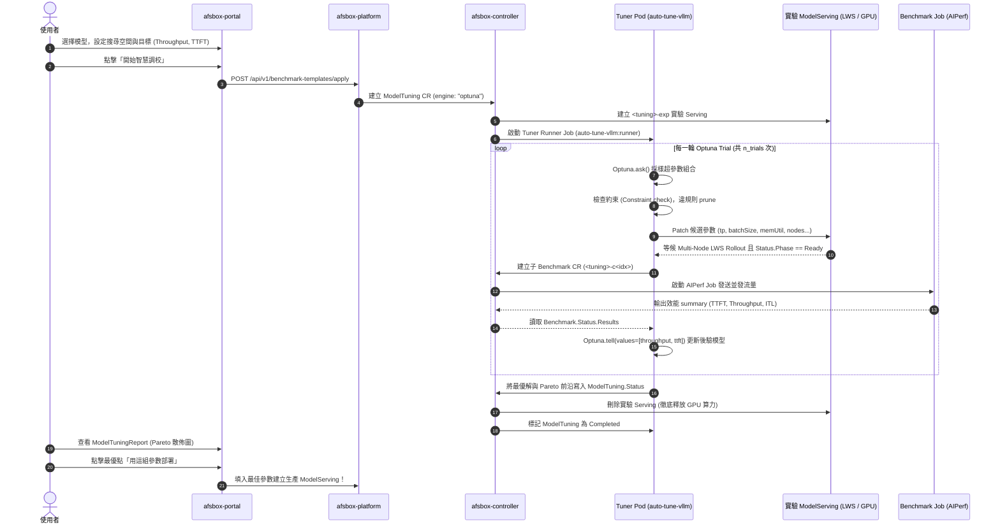

# AFSBox × auto-tuning-vllm (Optuna) 超參數自動調校整合設計與規劃

## 一、架構背景與設計理念

### 1.1 背景與問題
AFSBox 現有的推論調校功能（`ModelTuning`）採用靜態網格搜尋（Grid Search / Zip / OneAtATime）：
- **維度爆炸**：若調校 4 個維度各 4 個數值，需執行 $4^4 = 256$ 次測試。每次測試含 Pod 啟動、權重加載、預熱與 AIPerf 壓測約需 5~10 分鐘，整體耗時過長。
- **缺乏反饋（Blind Search）**：無法依據前期測試結果進行自適應學習；若某參數區間引發 OOM，靜態搜尋仍會重複嘗試。
- **難以權衡多目標**：Throughput（每秒吞吐）與 TTFT（首字延遲）通常互斥，使用者缺乏直觀的 Pareto 前沿決策依據。

### 1.2 整合目標
引進 [`auto-tuning-vllm`](https://github.com/openshift-psap/auto-tuning-vllm) 的 Optuna 核心，實現：
1. **自適應學習**：使用 TPE（貝氏最佳化）與 NSGA-II（多目標基因演算法），以 20~40 次 Trial 快速收斂至最佳參數區域。
2. **多目標 Pareto 前沿**：同時最佳化 Throughput（最大化）與 TTFT P95（最小化），產出帕雷托前沿解集。
3. **無效參數剪枝（Pruning）**：提前攔截不合規或已失敗的參數組合，零浪費 GPU 算力。
4. **保留 AFSBox 雲原生與多節點優勢**：完整複用 AFSBox 的 LeaderWorkerSet (LWS)、RDMA 互聯、S3 直讀串流與 NVIDIA AIPerf 壓測體系。

---

## 二、角色職責分工（Architecture & Roles）

採用**「方案 C：AFSBox 原生驅動 + auto-tune-vllm 演算法大腦」**模式：

```
┌─────────────────────────────────────────────────────────────────────────────┐
│ 1. 使用者介面 (afsbox-portal)                                                │
│    - 提供 Optuna 演算法選擇 (TPE / NSGA-II)                                 │
│    - 多目標權衡設定 (Throughput Maximize, TTFT Minimize)                    │
│    - 呈現 Pareto 前沿散佈圖，支援一鍵落地部署                               │
├─────────────────────────────────────────────────────────────────────────────┤
│ 2. API 與控制面 (afsbox-platform & afsbox-controller)                       │
│    - CRD: ModelTuning 擴充 OptimizationSpec                                  │
│    - 生命週期管理: 啟動 Tuner Runner Pod、建立實驗 ModelServing、壓測結束後清理  │
├─────────────────────────────────────────────────────────────────────────────┤
│ 3. 演算法搜尋大腦 (auto-tuning-vllm : runner 輕量容器)                       │
│    - 角色: Tuner Runner (純 CPU，~400MB 映像檔，秒級啟動)                     │
│    - 實作 AFSBoxK8sBackend (實現 ExecutionBackend 抽象介面)                  │
│    - 運行 Optuna 迴圈: ask() 產生超參數 ──> 操作 AFSBox ──> tell() 吸收指標   │
├─────────────────────────────────────────────────────────────────────────────┤
│ 4. 推論與多節點基座 (AFSBox ModelServing)                                    │
│    - 負責實體 GPU 排程、MIG、LeaderWorkerSet (LWS)、RDMA、vLLM/SGLang 執行期 │
├─────────────────────────────────────────────────────────────────────────────┤
│ 5. 基準測試引擎 (AFSBox Benchmark & NVIDIA AIPerf Job)                       │
│    - 獨立 Runner Pod 發送高並發請求，客觀產出 TTFT/ITL/Throughput JSON 指標 │
└─────────────────────────────────────────────────────────────────────────────┘
```

---

## 三、端到端數據流向時序圖（End-to-End Sequence）



---

## 四、指標精準映射（Metric Alignment）

| 調校目標概念 | `auto-tuning-vllm` 規格 | AFSBox `AIPerf` 產出指標 | 最佳化方向 |
| :--- | :--- | :--- | :--- |
| **吞吐量 (Throughput)** | `output_tokens_per_second` | `output_tokens_per_sec_per_user` / `output_token_throughput` | `maximize` |
| **首字延遲 (TTFT)** | `time_to_first_token_ms` | `ttft_p50` / `ttft_p95` | `minimize` |
| **字間延遲 (ITL)** | `inter_token_latency_ms` | `itl_p50` / `itl_p95` | `minimize` |
| **端到端延遲 (E2EL)** | `request_latency` | `e2e_p50` / `e2e_p95` | `minimize` |
| **每秒請求數 (RPS)** | `requests_per_second` | `request_throughput` | `maximize` |

---

## 五、各專案修改範圍與工作拆解

本次實作涉及全部 4 個專案，均已建立分支 `feat/optuna-tuning`：

| 專案 | 路徑 | 核心修改內容 |
| :--- | :--- | :--- |
| **1. auto-tuning-vllm** | `/mnt/d/work/ai-workspace/auto-tuning-vllm` | 1. 實作 `auto_tune_vllm/execution/afsbox.py`（`AFSBoxK8sBackend`）<br>2. 新增 `docker/Dockerfile.runner`（輕量 CPU-only 容器）<br>3. 支援 `--backend afsbox` 命令列與 K8s In-Cluster 配置 |
| **2. afsbox-controller** | `/mnt/d/work/afsbox/afsbox-controller` | 1. `api/v1beta1/modeltuning_types.go`: 擴充 `OptimizationSpec`（含 `engine: optuna`、`objectives`、`sampler`、`nTrials`）<br>2. `internal/controller/modeltuning/`: 支援啟動 Tuner Runner Job 或協調 Optuna 迴圈 |
| **3. afsbox-platform** | `/mnt/d/work/afsbox/afsbox-platform` | 1. `BenchmarkTemplate` 與 `ModelTuning` API 模型更新<br>2. 後端校驗 Optuna 搜尋維度與多目標參數 |
| **4. afsbox-portal** | `/mnt/d/work/afsbox/afsbox-portal` | 1. `TuningConfigSection.tsx`: 新增「Optuna 智慧調校」模式與目標選擇器<br>2. `ModelTuningReport.tsx`: 新增 Pareto Frontier 散佈圖與收斂歷史視覺化 |

---

## 六、實作分期（Phase Plan）

1. **Phase 1: `auto-tuning-vllm` 後端適配層（AFSBoxK8sBackend）與 Runner 映像檔**
   - 建立 `docker/Dockerfile.runner`。
   - 實作 `AFSBoxK8sBackend`，封裝 K8s CustomObjectsApi 對 ModelServing 與 Benchmark 的呼叫。
2. **Phase 2: Controller & Platform CRD 與調度整合**
   - 擴充 `ModelTuning` CRD 支援 `OptimizationSpec`。
   - Controller 遇到 `engine: optuna` 時自動派發 Tuner Runner Pod。
3. **Phase 3: Portal 前端多目標設定與 Pareto 報告**
   - 完善前端 UI 與視覺化，完成閉環體驗。
