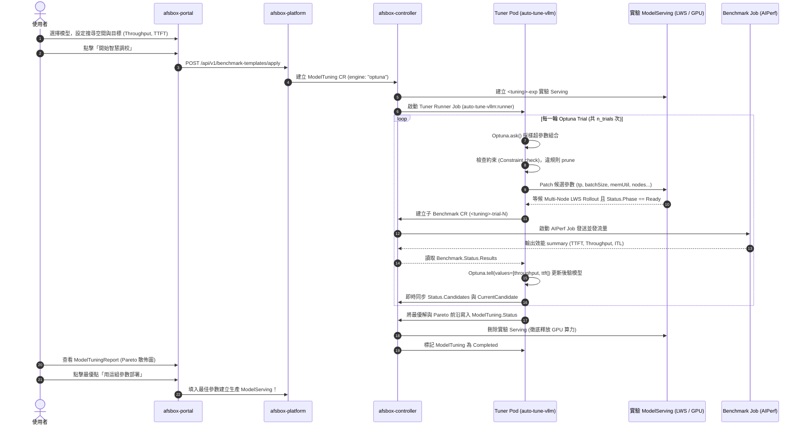

# AFSBox × auto-tuning-vllm (Optuna) 超參數自動調校整合設計與規劃

## 一、架構背景與設計理念

### 1.1 背景與問題
AFSBox 現有的推論調校功能（`ModelTuning`）採用靜態網格搜尋（Grid Search / Zip / OneAtATime）：
- **維度爆炸**：若調校 4 個維度各 4 個數值，需執行 $4^4 = 256$ 次測試。每次測試含 Pod 啟動、權重加載、預熱與 AIPerf 壓測約需 5~10 分鐘，整體耗時過長。
- **缺乏反饋（Blind Search）**：無法依據前期測試結果進行自適應學習；若某參數區間引發 OOM，靜態搜尋仍會重複嘗試，造成數小時的算力浪費。
- **難以權衡多目標**：Throughput（每秒吞吐）與 TTFT（首字延遲）通常互斥，使用者缺乏直觀的 Pareto 前沿決策依據。

### 1.2 整合目標
引進 [`auto-tuning-vllm`](https://github.com/openshift-psap/auto-tuning-vllm) 的 Optuna 核心，實現：
1. **自適應學習**：使用 TPE（貝氏最佳化）與 NSGA-II（多目標基因演算法），以 15~30 次 Trial 快速收斂至最佳參數區域。
2. **多目標 Pareto 前沿**：同時最佳化 Throughput（最大化）與 TTFT P95（最小化），產出帕雷托前沿解集。
3. **無效參數剪枝（Pruning）**：提前攔截不合規或已失敗的參數組合，零浪費 GPU 算力。
4. **保留 AFSBox 雲原生與多節點優勢**：完整複用 AFSBox 的 LeaderWorkerSet (LWS)、RDMA 互聯、S3 直讀串流與 NVIDIA AIPerf 壓測體系。

---

## 二、角色職責分工（Architecture & Roles）

採用**「方案 C：AFSBox 原生驅動 + auto-tune-vllm 演算法大腦」**模式：

```
┌─────────────────────────────────────────────────────────────────────────────┐
│ 1. 使用者介面 (afsbox-portal)                                                │
│    - 提供 Optuna 演算法選擇 (TPE / NSGA-II)                                 │
│    - 多目標權衡設定 (Throughput Maximize, TTFT Minimize)                    │
│    - 呈現 Pareto 前沿散佈圖，支援一鍵落地部署                               │
├─────────────────────────────────────────────────────────────────────────────┤
│ 2. API 與控制面 (afsbox-platform & afsbox-controller)                       │
│    - CRD: ModelTuning 擴充 OptimizationSpec                                  │
│    - 生命週期管理: 啟動 Tuner Runner Pod、建立實驗 ModelServing、壓測結束後清理  │
├─────────────────────────────────────────────────────────────────────────────┤
│ 3. 演算法搜尋大腦 (auto-tuning-vllm : runner 輕量容器)                       │
│    - 角色: Tuner Runner (純 CPU，~400MB 映像檔，秒級啟動)                     │
│    - 實作 AFSBoxK8sBackend (實現 ExecutionBackend 抽象介面)                  │
│    - 運行 Optuna 迴圈: ask() 產生超參數 ──> 操作 AFSBox ──> tell() 吸收指標   │
├─────────────────────────────────────────────────────────────────────────────┤
│ 4. 推論與多節點基座 (AFSBox ModelServing)                                    │
│    - 負責實體 GPU 排程、MIG、LeaderWorkerSet (LWS)、RDMA、vLLM/SGLang 執行期 │
├─────────────────────────────────────────────────────────────────────────────┤
│ 5. 基準測試引擎 (AFSBox Benchmark & NVIDIA AIPerf Job)                       │
│    - 獨立 Runner Pod 發送高並發請求，客觀產出 TTFT/ITL/Throughput JSON 指標 │
└─────────────────────────────────────────────────────────────────────────────┘
```

---

## 三、端到端數據流向時序圖（End-to-End Sequence）



---

## 四、Optuna 隨需啟動、時序與防停等生命週期（Execution Lifecycle & Safety Guardrails）

### 4.1 隨需啟動機制（On-Demand Job vs. Daemon）
Optuna 並非作為常駐的背景 Daemon 運行，而是採用**「雲原生隨需即開（Run-to-Completion）」**模式：
1. 當使用者在 Portal 送出調校請求，`afsbox-platform` 建立 `ModelTuning` CR。
2. `afsbox-controller` 在 `reconcilePending` 識別 `isOptuna(tuning) == true`。
3. Controller 建立底層載體 `<tuning>-exp` ModelServing，並調用 `ensureTunerJob` 建立 K8s 原生 `batchv1.Job`（名稱為 `<tuning>-tuner`）。
4. 容器映像檔為純 CPU 的輕量鏡像（`auto-tune-vllm:runner`，約 400MB），不佔用任何實體 GPU。

### 4.2 啟動後執行時序（9 步全生命週期）
1. **組態合成 (Synthesis)**：Tuner Pod 啟動後，連線 In-Cluster K8s API 讀取父級 `ModelTuning` CR 的 `spec.optimization` 與 `spec.testSuite`，在記憶體中自動合成 Optuna 組態。
2. **智慧採樣 (Ask)**：Sampler（NSGA-II 或 TPE）計算後驗機率分佈，採樣出一組超參數（如 `tp=2, gpu_mem=0.9`）。
3. **底層注入 (Patch)**：`AFSBoxK8sBackend.submit_trial()` 對 `<tuning>-exp` 進行 Spec Patch。
4. **等待就緒 (Wait Ready)**：等待 ModelServing 的 LeaderWorkerSet 完成滾動更新，確認 `Phase == Ready` 且 `observedGeneration >= generation`。
5. **發起壓測 (Trigger Benchmark)**：建立子 `Benchmark` CR（名稱為 `<tuning>-trial-N`），觸發 AIPerf 引擎。
6. **收集指標與回饋 (Tell & Sync)**：讀取壓測產出的 TTFT、Throughput、ITL，呼叫 `Optuna.tell()` 更新後驗模型，同時寫回 `status.candidates` 供前端即時顯示進度。
7. **迴圈迭代 (Loop)**：重複步驟 2~6 直到跑滿 `n_trials`（預設 20 輪）。
8. **前沿寫回 (Writeback)**：Tuner 結束前呼叫 `sync_final_results_to_tuning`，將 `bestCandidate` 與 `paretoFrontier` 寫入 `ModelTuning.status`。
9. **收斂退出 (Exit 0)**：Tuner Job 正常退出，Controller 接手進行 GPU 資源釋放。

### 4.3 四層防停等與死鎖護欄體系（Anti-Hanging Guardrails）
| 層級 | 防護對象 | 潛在停等風險 | 系統防護機制 |
| :--- | :--- | :--- | :--- |
| **L1** | **ModelServing 啟動** | 某組參數顯存超額引發 OOM，或 Pod CrashLoopBackOff | `deploy_timeout_seconds`（預設 600s）。若 Serving 轉為 `Failed` 或超時未 Ready，立即中斷該 Trial 判定為失敗，Optuna 施加極大懲罰後直接進下一輪，**絕不卡住**。 |
| **L2** | **AIPerf 壓測執行** | 網路中斷或請求掛起導致壓測 Pod 卡死 | AFSBox `Benchmark.spec.suite` 內建 `timeoutSeconds`（預設 300s），且 Benchmark Controller 配置有原生 `ActiveDeadlineSeconds`，超時自動標記 `Failed`，Tuner 後端立刻結案該輪。 |
| **L3** | **Tuner Job 自身** | 演算法內部異常或連線死鎖導致 Job 不退出 | `batchv1.JobSpec` 配置了 `ActiveDeadlineSeconds: 7200`（2 小時硬上限）。超過 2 小時 K8s 排程器**強制終止 Job**。 |
| **L4** | **GPU 並發衝突** | 多個 Trial 同時搶同一張卡導致互撞 | 啟動命令固定傳入 `--max-concurrent-trials 1`，強制單一序向執行，徹底杜絕並發資源競爭。 |

### 4.4 完成通知與狀態雙保險機制
1. **APIServer 即時推播（Watch Event）**：
   * Controller 註冊了 `Owns(&batchv1.Job{})`。
   * Tuner Job 一旦完成（`JobComplete` 條件為 True），APIServer 會微秒級推播事件喚醒 Controller 進入 `reconcileRunning`。
2. **5 秒備援輪詢（Poll Fallback）**：
   * Controller 設有 `RequeueAfter: 5s`，即使遇到極端網路抖動漏掉事件，每 5 秒也會主動檢查一次 Job 狀態。
3. **前端 Portal 即時渲染**：
   * Portal 透過 TanStack Query 每 3 秒輪詢後端，一旦 Controller 將 Phase 標記為 `Completed`，UI 即刻切換為完成狀態並繪製帕雷托圖表。

### 4.5 資源分級清理與垃圾回收（Resource Deletion & GC）
1. **實驗 ModelServing（佔用昂貴 GPU）**：
   * **立刻刪除**。Controller 在 `reconcileFinalizing` 階段第一時間執行 `r.Delete(ctx, exp)`，立即歸還 GPU、LWS 容器與顯存。
2. **Tuner Runner Job（純 CPU Pod）**：
   * 配置了 `TTLSecondsAfterFinished: 86400`（24 小時後自動回收）。
   * 完工後 Pod 處於 `Completed` 狀態不佔 CPU/GPU，保留 24 小時便於工程師使用 `kubectl logs job/<tuning>-tuner` 查閱搜尋日誌。
3. **子 Benchmark CRs（壓測報告與歷史數據）**：
   * **調校完當下不刪除**，因為調校報告需要調閱每輪 Trial 的詳細數據。
   * 每個子 Benchmark 均打上 `OwnerReference` 指向父級 `ModelTuning`。**當使用者在 Portal 點擊刪除該任務時，K8s 垃圾回收器會自動級聯清空所有相關的子 Benchmark，零孤兒物件殘留**。

### 4.6 測試流量鑑權與 API Token 機制
* **為什麼需要 API Token？**：
  * **不是給 Optuna 用的**（Optuna 跑在 K8s 內部透過 ServiceAccount 通訊）。
  * **是給 AIPerf 壓測引擎用的**。在 AFSBox 規範（PR `!210`）中，所有流經內部 `AgentGateway` 的模型請求均採取 **Deny-by-Default** 零信任政策，未帶 Token 會回傳 `401 Unauthorized`。
* **Token 來源**：使用者只要在 AFSBox Portal 左側選單的 **`Workspace ──> API Keys`** 複製既有的模型存取金鑰即可。
* **安全保護**：Platform 收到後會存入 K8s Secret（`<tuning>-apikey`），CR 僅記載 `SecretKeyRef`，絕不外洩明文。該 Secret 同樣綁定 OwnerReference，隨任務刪除自動級聯銷毀。

---

## 五、Benchmark 壓測參數配置與映射機制（Benchmark Alignment）

在 `backend: afsbox` 架構下，壓力測試由 AFSBox 叢集內的 `Benchmark` CR（NVIDIA AIPerf 引擎）負責。系統支援雙模式獲取 Benchmark 壓測組態：

### 5.1 雙模式運作
1. **模式 A：AFSBox CR / Portal UI 驅動（推薦在生產與平台環境）**：
   * 使用者在 Portal 介面選擇模型與壓測模板，組態自動存入 `ModelTuning.spec.testSuite`。
   * `auto-tuning-vllm` 的 Tuner Runner 啟動後，`AFSBoxK8sBackend` 會**優先讀取並鎖定該 `testSuite`**，每輪 Optuna Trial 直接套用此測試規格。
2. **模式 B：YAML / CLI 驅動（供研發實驗與離線自動化）**：
   * 開發者撰寫 Study YAML 檔中的 `benchmark:` 區塊，`AFSBoxK8sBackend._build_benchmark_suite()` 會自動將其轉換為標準 AFSBox `Benchmark.spec.suite`。

### 5.2 參數精準映射表
| `auto-tuning-vllm` 欄位 | AFSBox `Benchmark.spec.suite[0].params` (AIPerf) | 說明與作用 |
| :--- | :--- | :--- |
| `samples` | `requestCount` | 總發送請求數 (例如 200) |
| `rate` / `concurrency` | `concurrency` | 同時在途併發路數 (例如 16) |
| `request_rate` | `requestRate` (`type: "request-rate"`) | 開迴路到達速率（設為 `"inf"` 則為閉迴路固定併發） |
| `prompt_tokens` | `isl: { mean: 1024, stddev: 0 }` | 輸入序列長度常態分佈 |
| `output_tokens` | `osl: { mean: 512, stddev: 0 }` | 輸出序列長度常態分佈 |
| `dataset: "sharegpt"` | `dataset: "sharegpt"` (`type: "dataset-replay"`) | 資料集重放 (支援 `sharegpt`, `sonnet`) |
| `max_seconds` | `timeoutSeconds` | 單次壓測最大執行超時時間 |
| *(自動注入)* | `streaming: true` | **固定開啟**（SSE 串流是量測 TTFT/ITL 的必要前提） |
| *(自動注入)* | `ignoreEOS: true` | **固定開啟**（強制測滿指定 OSL，避免模型提早結束導致吞吐被虛假高估） |

### 5.3 Study YAML 範例 (`examples/study_config_afsbox.yaml`)
```yaml
study:
  name: "llama3_afsbox_tuning"

backend: "afsbox"
afsbox:
  namespace: "default"
  tuning_name: "llama3-tuning-01"
  deploy_timeout_seconds: 600

optimization:
  approach: "multi_objective"
  objectives:
    - metric: "output_tokens_per_second"
      direction: "maximize"
    - metric: "time_to_first_token_ms"
      direction: "minimize"
  sampler: "nsga2"
  n_trials: 20
  max_concurrent_trials: 1

benchmark:
  benchmark_type: "aiperf"
  model: "meta-llama/Meta-Llama-3-8B-Instruct"
  samples: 200
  rate: 16
  request_rate: "inf"
  prompt_tokens: 1024
  output_tokens: 512
  dataset: "sharegpt"
  max_seconds: 300

parameters:
  tensor_parallel_size:
    enabled: true
    options: [1, 2]
  max_num_batched_tokens:
    enabled: true
    options: [2048, 4096, 8192]
  gpu_memory_utilization:
    enabled: true
    min: 0.80
    max: 0.95
    step: 0.05
```

---

## 六、超參數搜尋空間全景（Hyperparameter Search Space）

系統絕不僅限於基礎參數，而是支援 **vLLM / SGLang 的全方位效能旋鈕** 以及 **任意自訂 CLI 旗標**。

### 6.1 核心參數分類一覽表
| 領域分類 | 參數名稱 (Variable) | 調校模式 | 常見取值範例 | 效能影響與調優目標 |
| :--- | :--- | :---: | :--- | :--- |
| **吞吐量與批次排程** | `max_num_batched_tokens` | `Values` | `[2048, 4096, 8192, 16384]` | 單步最大 Token 數，極度影響 Throughput。 |
| | `max_num_seqs` (`batchSize`) | `Range/Values` | `min: 64, max: 512, step: 64` | 同時併發處理序列上限。 |
| | `enable_chunked_prefill` | `Values` | `[true, false]` | 分塊預填充，有效平抑高併發時的 TTFT 延遲尖峰。 |
| | `max_model_len` (`contextLength`)| `Values` | `[4096, 8192, 32768]` | 上下文長度限制，縮小可釋放顯存給更大 Batch。 |
| **顯存與 KV 快取** | `gpu_memory_utilization` | `Range` | `min: 0.80, max: 0.96, step: 0.02` | GPU 顯存佔用上限，過高恐 OOM，過低吞吐差。 |
| | `kv_cache_dtype` | `Values` | `["auto", "fp8", "fp8_e4m3", "fp8_e5m2"]` | KV 快取量化，改為 fp8 可顯存減半、併發容量翻倍。 |
| | `block_size` | `Values` | `[16, 32]` | PagedAttention 快取分塊大小。 |
| | `swap_space` | `Range` | `min: 4, max: 16, step: 4` | CPU 換頁記憶體（GiB），防止偶發負載爆量崩潰。 |
| **分散式並行策略** | `parallelism.tp` (`tensor_parallel_size`) | `Values` | `[1, 2, 4, 8]` | 張量平行度，跨卡拆分，跨卡通信影響延遲。 |
| | `parallelism.pp` (`pipeline_parallel_size`) | `Values` | `[1, 2, 4]` | 流水線平行度，超大模型跨節點切層。 |
| | `parallelism.ep` | `Values` | `[1, 2, 4]` | 專家平行度（針對 DeepSeek / Qwen 等 MoE 模型）。 |
| **核心加速與編譯** | `enable_cuda_graphs` | `Values` | `[true, false]` | 是否啟用 CUDA Graphs，大幅降低 CPU 調度開銷。 |
| | `attention_backend` | `Values` | `["FLASH_ATTN", "XFORMERS", "TORCH_SDPA"]` | 底層注意力運算核心選擇。 |
| | `speculative_model` / `num_speculative_tokens` | `Values` | `[1, 3, 5]` | 投機解碼（Speculative Decoding）草稿步數。 |
| **量化加載** | `quantization` | `Values` | `["awq", "gptq", "fp8", "bitsandbytes"]` | 權重量化方式。 |
| **任意自訂旗標** | `extraArgs` / 自訂變數 | `Values` | `--flag=val` | 任何 vLLM CLI 新旗標均可直接透傳注入。 |

---

## 七、Portal 前端互動設計與參數填寫規格（Portal UI & UX Design）

在 `afsbox-portal` 中，Optuna 自適應調校直接嵌入在推論部署精靈的「部署前調校（Tuning Mode）」中：

### 7.1 面板四層結構
1. **搜尋引擎與最佳化模式 (Optimization Engine)**：
   - 提供「Optuna 自適應最佳化 (推薦)」與「傳統網格搜尋 (Static Grid)」切換。
   - **採樣演算法 (Sampler)**：下拉選單（`NSGA-II (多目標)`、`TPE (貝氏最佳化)`、`Random`）。
   - **試驗輪數 (n_trials)**：自訂測試輪數（預設 20 次，可設 10~100）。
   - **多目標權衡 (Objectives)**：Switch 開關勾選「吞吐量最大化 (Tokens/s)」與「首字延遲最小化 (TTFT P95)」。
2. **超參數搜尋維度 (Search Space Dimensions)**：
   - 點擊「+ 新增維度」，可挑選引擎內建題目、自訂變數或指令變體。
   - 支援連續範圍（Range：min, max, step）或離散清單（Values：選項清單）。
3. **壓力測試規格 (TestSuite Conditions)**：
   - 設定 AIPerf 壓測型態、併發路數、總請求數、ISL/OSL 與超時時間。
4. **驗證與送出 (Confirm & Launch)**：
   - 填寫調校顯示名稱與內部 Gateway 鑑權用 API Key，點擊「開始 Optuna 智慧調校」。

### 7.2 欄位屬性規格一覽
| 欄位區塊 | 欄位名稱 | 必填/選填 | 預設值 | 說明 |
| :--- | :--- | :---: | :---: | :--- |
| **演算法組態** | 搜尋引擎 (`engine`) | **必選** | `optuna` | `optuna` 或 `static`。 |
| | 採樣演算法 (`sampler`) | 選填 | `nsga2` | 推薦多目標使用 `nsga2`，單目標推薦 `tpe`。 |
| | 試驗輪數 (`n_trials`) | 選填 | `20` | 建議 15~30 輪即可快速收斂。 |
| | 最佳化目標 (`objectives`) | **必選至少一項** | 雙開 (Throughput + TTFT) | 決定 Optuna 損失函數與收斂方向。 |
| **搜尋空間** | 調校維度 (`dimensions`) | **必填至少一維** | 系統建議 4 參數 | 可自由增刪為任意 vLLM 參數。 |
| **壓測標準** | 測試項目 (`testSuite`) | **必填至少一項** | `concurrency` (c=8, n=100) | 決定每輪 Trial 的客觀測試標準。 |
| **執行安全** | 存取金鑰 (`apiKey`) | **必填** | 無 (使用者手動輸入) | 供子 Benchmark 經內部 agentgateway 通訊鑑權。 |
| | 任務名稱 (`displayName`) | 選填 | 自動產生 | UGC 顯示名（支援中文）。 |

---

## 八、Optuna 與 Static 模式架構對比、相容性與硬體邊界（Architecture Comparison & Constraints）

### 8.1 為什麼 Static 寫在 Controller 內，而 Optuna 採用獨立 Tuner Job？
* **Static 模式**：
  * 本質是**無狀態的固定迴圈（Stateless For-Loop）**。
  * Platform 先透過 `sweep_combine.go` 的笛卡爾積算好候選清單（`c01, c02...`），Controller 只需要按陣列順序跑，不涉及動態決策，寫在 Go 裡面最簡潔。
* **Optuna 模式**：
  * 本質是**有狀態的機器學習統計運算（Stateful ML Loop）**。
  * 依賴複雜數學（NumPy, SciPy, TPE, NSGA-II），Go 語言缺乏成熟庫。
  * **抗故障高可用**：將其做成獨立的 Tuner Job Pod，即使 Controller 在 2 小時調校過程中重啟或升級，**跑在背景的 Tuner 運算完全不受干擾**。Controller 恢復後只需查看 Job 狀態即可接軌。
  * **跑完即焚 (Run-to-Completion)**：不需要常駐維護一個 Python RPC Server，調校結束 Pod 自動銷毀，不浪費叢集常態資源。

### 8.2 原本 Static 未支援 TP/顯存的歷史原因
* **調查結論**：原本未支援**不是因為技術死穴，而是剛好卡在架構重構的交接期**。
* **Git 紀錄證實**：在 2026-09-01（Commit `880112ffe`）的重構中，團隊將 `ModelServingSpec` 改為具名欄位，當時工程師先填補了最常用的 3 個欄位，並留有註解：`// tuning 變數要改指 spec 的欄位路徑...那是獨立工項，尚未做。`
* **解鎖現況**：本次重構已全面補齊 `helpers.go`，使底層 `setVariable` 同時解鎖了 TP、顯存、KV 快取與自訂參數。

### 8.3 調校進階參數的 4 大客觀物理限制
使用者在設定調校維度時，平台雖已解鎖，但仍需注意以下客觀限制：
1. **實體 GPU 卡數容量限制**：
   * 若叢集單節點只有 2 張卡，但調校維度包含 `TP=4`，Pod 會因為節點資源不足卡在 `Pending` 狀態（超時後系統會記錄 `DeployTimedOut` 並跳過）。
2. **GPU 架構代數限制（硬體不支援）**：
   * 原生 FP8 KV 快取（`kv_cache_dtype: fp8`）僅支援 NVIDIA Ada Lovelace（L4/4090）與 Hopper（H100/H200）以上顯卡。跑在舊卡（如 A100）上 vLLM 會直接拋錯中斷該 Trial。
3. **模型張量幾何整除限制**：
   * `TP` 必須能夠整除該模型的注意力頭數（Attention Heads）。例如 32 頭的模型若設定 `TP=3` 或 `TP=6`，vLLM 會在啟動階段報錯。
4. **Static 盲踩 OOM 浪費 vs. Optuna 智慧避坑**：
   * 在 Static 模式中，若某個參數（如顯存 0.98）會引發 OOM，靜態網格依然會盲目地為每一組組合重複加載模型測試 10 分鐘，浪費數百分鐘。
   * Optuna 模式在第 1 輪發現 OOM 失敗後，貝氏演算法會給予嚴重懲罰，**後續輪次會自動主動繞開該崩潰區域**。

### 8.4 Webhook 防雙源漂移與 GPUClaim 自動聯鎖機制
* AFSBox 的 ModelServing Webhook 具備 `validateParallelismGPUCountConsistency` 規則，強制要求 `gpuClaim.requests.count` 必須與 `TP * PP * DP / nodes` 推導值一致。
* 我們在 `helpers.go` 實作了 `syncGPUClaimCount(spec)`：**當調校修改 TP 或 PP 時，系統會自動重新推導並同步更新 `GPUClaim.Requests.Count`**，徹底杜絕了被 Webhook 當場拒絕的衝突問題。

---

## 九、部署架構、所屬 Helm Chart 與發布流程（Deployment & Helm Architecture）

### 9.1 所屬 Helm Chart 分工矩陣
| 部件名稱 | 原始碼目錄 | 所屬 Helm Chart | 部署型態 | 職責與角色 |
| :--- | :--- | :--- | :--- | :--- |
| **控制面 Operator** | `afsbox-controller` | **`charts/afsbox-controller`** | `Deployment` (常駐) | 提供 `ModelTuning` CRD、派發 Tuner Job、調校結束後刪除實驗 Serving 釋放 GPU。 |
| **後端 API (BFF)** | `afsbox-platform` | **`charts/afsbox-platform`** | `Deployment` (常駐) | 接收 Portal 請求、寫入 CR、提供調校報告 API。 |
| **前端 UI (Portal)** | `afsbox-portal` | **`charts/afsbox-portal`** | `Deployment` (Nginx) | 部署精靈中的 Optuna 表單與 Pareto 散佈圖報表。 |
| **演算法大腦 (Optuna)** | `auto-tuning-vllm` | **隨需映像檔**<br>*(不建獨立 Chart)* | **`batchv1.Job`**<br>*(跑完退出)* | 純 CPU 輕量容器（~400MB），執行 Optuna 採樣迴圈，完工後自動結束。 |

### 9.2 Tuner 映像檔三級覆寫機制
```
Level 1 (CR 級自訂): ModelTuning.spec.optimization.tunerImage
         │ (若未設定，往下一級 fallback)
         ▼
Level 2 (Helm 級環境變數): afsbox-controller 的 OPTUNA_TUNER_IMAGE
         │ (若未設定，往下一級 fallback)
         ▼
Level 3 (系統預設): keyword1983/auto-tune-vllm:runner
```
在離線或企業私有 Harbor 環境中，只需在 `charts/afsbox-controller` 的 `values.yaml` 中配置：
```yaml
controllerManager:
  extraEnv:
    - name: OPTUNA_TUNER_IMAGE
      value: "harbor.internal.corp/afsbox/auto-tune-vllm:runner"
```

### 9.3 完整部署發布指南（4 步驟）
1. **建置演算法 Runner 映像檔**：
   ```bash
   cd /mnt/d/work/ai-workspace/auto-tuning-vllm
   docker build -f docker/Dockerfile.runner -t <registry>/auto-tune-vllm:runner .
   docker push <registry>/auto-tune-vllm:runner
   ```
2. **升級 `afsbox-controller` Chart**：
   ```bash
   helm upgrade -i afsbox-controller ./charts/afsbox-controller -n afsbox-system
   ```
3. **升級 `afsbox-platform` Chart**：
   ```bash
   helm upgrade -i afsbox-platform ./charts/afsbox-platform -n afsbox-system
   ```
4. **升級 `afsbox-portal` Chart**：
   ```bash
   helm upgrade -i afsbox-portal ./charts/afsbox-portal -n afsbox-system
   ```

---

## 十、各專案修改範圍與工作拆解（Commit 追蹤清單）

| 專案 | 本地路徑 | 最新 Commit | 核心修改內容 |
| :--- | :--- | :--- | :--- |
| **1. auto-tuning-vllm** | `/mnt/d/work/ai-workspace/auto-tuning-vllm` | `8a43028` | 1. 實作 `AFSBoxK8sBackend` 串接 K8s API<br>2. 實作 `_build_benchmark_suite()` 自動映射 Benchmark 參數<br>3. 支援新版 ModelServing 規格（`batchSize`, `gpuMemoryUtilization`, `prefillSettings.maxBatchTokens`）<br>4. 實作 `observedGeneration` 等候防競爭機制<br>5. 串接獨立 `BenchmarkReport` 擷取 Throughput / TTFT 指標 |
| **2. afsbox-controller** | `/mnt/d/work/afsbox/afsbox-controller` | `4471460` | 1. `modeltuning_types.go`: 擴充 `OptimizationSpec`、`ObjectiveSpec`、`ParetoFrontier`<br>2. 更新 CRD OpenAPI YAML schemas<br>3. `helpers.go`: 擴充 `setVariable` 支援 TP/PP/KV 快取，並實作 `syncGPUClaimCount` 避免 Webhook 雙源漂移<br>4. `modeltuning_controller.go`: 實作 `ensureTunerJob`，配置 `ActiveDeadlineSeconds: 7200`、`TTLSecondsAfterFinished: 86400` 與 `OPTUNA_TUNER_IMAGE` 環境變數覆寫機制 |
| **3. afsbox-platform** | `/mnt/d/work/afsbox/afsbox-platform` | `50cdd79e` | 1. `models/template.go`: `ApplyTemplateRequest` 新增 `OptimizationRequest`<br>2. `services/template.go`: `ApplyTemplate` 透傳 `OptimizationSpec`<br>3. `models/tuning.go` & `services/tuning_report.go`: 調校報告投影新增 `OptimizationView`、`BestCandidate` 與 `ParetoFrontier` |
| **4. afsbox-portal** | `/mnt/d/work/afsbox/afsbox-portal` | `5e05399a` | 1. `api-types.ts`: 定義前後端 Optuna 型別契約<br>2. `TuningConfigSection.tsx`: 部署精靈新增 Optuna 卡片、Sampler、輪數與目標切換<br>3. `ModelTuningReport.tsx`: 呈現 Optuna 摘要卡片，標註「🏆 最佳解」與「✨ 帕雷托前沿」徽章 |

---

## 十一、實機真實叢集整合驗證（NVIDIA GB10 實測記錄）

在真實 AFSBox 叢集（節點 `172.20.36.21`，配備 NVIDIA GB10 128GB Unified Memory GPU）上，使用 `facebook/opt-125m` 進行了 20 輪 TPE 貝氏最佳化自動調校，完整驗證了全鏈路的雲原生整合：

### 11.1 核心修復與關鍵結論
1. **動態參數映射（Dynamic Parameter Mapping）**：
   - 實作在 `_map_parameters_to_serving_patch`，自動將 Optuna 推薦之下劃線命名轉為 K8s CRD CamelCase 欄位（如 `batchSize`, `gpuMemoryUtilization`），未知旗標自動包裝進 `extraCommand`。
2. **防競爭 Rollout 同步（Generation-Aware Sync）**：
   - 解決 Client Patch 後 Controller 尚未反應的競態條件，確保 `status.observedGeneration >= metadata.generation` 且 `status.phase == Ready` 後才發起壓測。
3. **獨立 BenchmarkReport 指標萃取**：
   - 自動透過 `Benchmark.status.reportRef` 追蹤取得同名 `BenchmarkReport`，解析 `spec.items[0].metrics` 萃取出 Throughput、TTFT 等即時指標供 Optuna 計算目標分數。
4. **Base 模型 Chat Template 注入**：
   - 為 OPT-125M 等純 Base 模型追加 `--chat-template=/vllm-workspace/examples/template_chatml.jinja`，解決 AIPerf `/v1/chat/completions` 缺少對話樣板回傳 HTTP 400 的問題。
5. **內網 Service 端點直連**：
   - Benchmark CR 指定 `target.endpoint.url = http://<service>.<ns>.svc.cluster.local:8000/v1`，實現純淨內網直連壓測。

